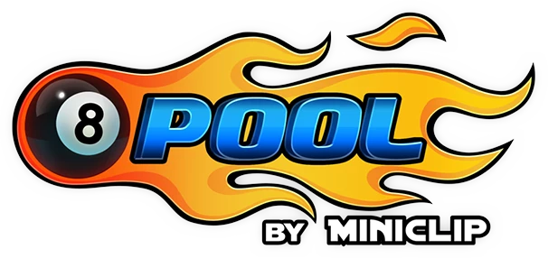

<div align="center">



</div>

# 🎱 8 BALL POOL TRACKING VISION

Script that makes your life much easier ✌

> [!CAUTION]
> Use it at your own risk, I am not responsible for account suspensions or bans

## 🛠️ Support

List of future options that the script will consider:

<div align="center">
  <table>
    <tr>
      <th>Support</th>
      <th>Description</th>
    </tr>
    <tr align="center">
      <td>:heavy_check_mark:</td>
      <td>Overlay screen for guide line assistance</td>
    </tr>
    <tr align="center">
      <td>:heavy_check_mark:</td>
      <td>Tracking the ball using bands</td>
    </tr>
    <tr align="center">
      <td>:hourglass_flowing_sand:</td>
      <td>Auto aiming to pockets</td>
    </tr>
    <tr align="center">
      <td>:hourglass_flowing_sand:</td>
      <td>Automatic play using computer vision</td>
    </tr>
  </table>
</div>

## 🧱 How to start

1. Clone the repository

```bash
git clone https://github.com/SprikerS/8-ball-js.git
```

2. Open project directory

## 🛠️ Technologies

For the development of this project the following were used:

- Javascript
- Tauri

## 🔑 License

This project is licensed under the MIT License, see the file [LICENSE](LICENSE) for more details